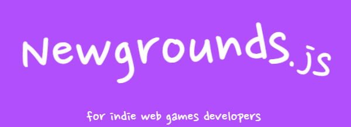

**Newgrounds.js** is the first good and complete library for use [Newgrounds.io](https://newgrounds.io) functions and utilities for your game. The best? You can use with any framework or game engine of Javascript or web tecnologies, like [Kaboom](https://kaboomjs.com) or [Phaser](https://phaser.io)

[**Docs**](https://github.com/lajbel/newgrounds-js/wiki)

## Features 🎁

- Functions with everything your game needs
- Ability to call all components if you want
- Use the npm package or use the ES6 module, or a tag script!

## Example

```js
const newgrounds = require("newgrounds.js");

newgrounds.connect("533327:b6GaR8Eb", "ivuwzsfewkqñwacRQ==");

newgrounds.unlockMedal(129521);
newgrounds.postScore(12052012, 50);
```

## Install

npm: `npm i newgrounds.js` <br>
cdn: [jsdelivr](https://cdn.jsdelivr.net/npm/newgrounds.js@latest/dist/newgrounds.mjs) or [unpkg](https://unpkg.com/newgrounds.js@latest/dist/newgrounds.mjs)

## Credits

[Newgrounds.io](https://newgrounds.io) <br>
[Javascript Wrapper](https://github.com/KilledByAPixel/newgrounds) by [KilledByAPixel](https://github.com/KilledByAPixel)
