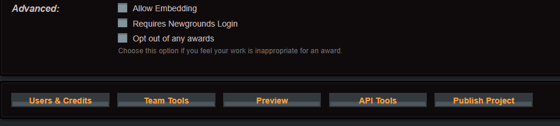
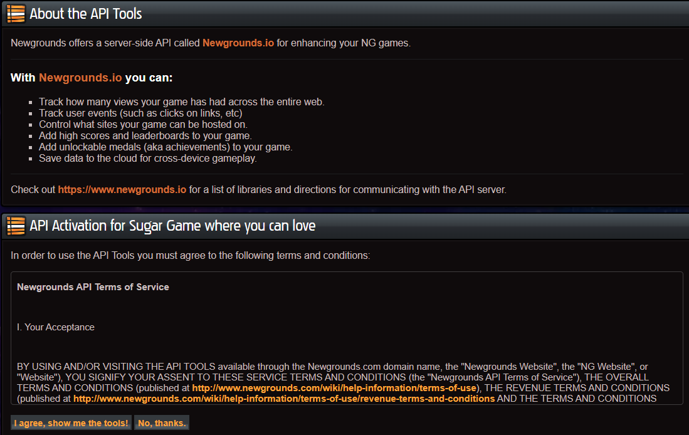
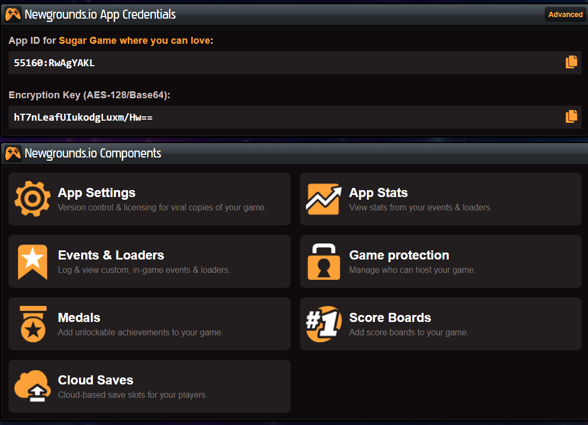

# Creating a project

I assume you already have a Newgrounds.com account. Now you need create a project, go to upload and select **Game** 🎮

Now we need go to the down of the page and select **API Tools**

Now read & accept the terms to use the Api Tools, and we can start with code

